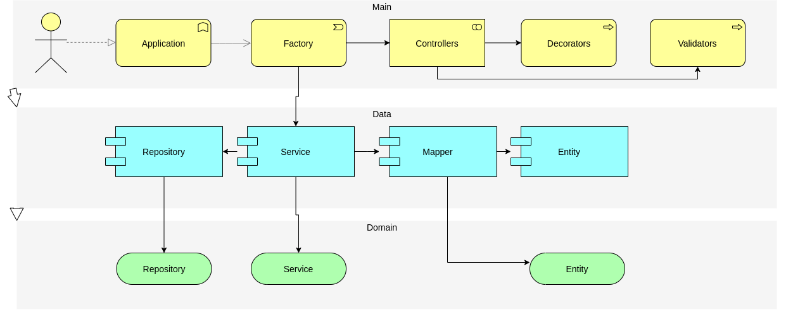

# Clean todo APP

**Objetivo:**

Este projeto é uma APP para um kanban board de tarefas e to-do. Contempla, todo, categoria de todo e comentários em todos.

Projeto com fins didáticos.

# :footprints: Primeiros passos

- [Requisitos mínimos](#warning-requisitos-mínimos)
- [Iniciar projeto](#runner-iniciar-projeto)
- [Estrutura](#building_construction-estrutura)
- [Considerações](#notebook-considerações)
- [API](https://github.com/jeanmolossi/curly-sniffle)

# :warning: Requisitos mínimos

**Você precisa ter instalado [Node](https://github.com/nodesource/distributions/blob/master/README.md), [npm](https://nodejs.org/en/download/), [yarn](https://classic.yarnpkg.com/lang/en/docs/install/#debian-stable), [Docker (Ubuntu)](https://docs.docker.com/engine/install/ubuntu/) ou [Docker (Windows)](https://docs.docker.com/desktop/windows/install/) e [docker-compose](https://docs.docker.com/compose/install/)**

# :runner: Iniciar Projeto

Previamente, você precisa instalar as dependências do projeto. Para isso, na raiz do projeto, execute:

```shell
yarn
```

Em seguida execute o comando:

```shell
yarn start
```

Este comando fará com que sua aplicação inicie.

# :building_construction: Estrutura

A estrutura final deste projeto ficará da seguinte forma:



# :notebook: Considerações

Acompanhe as versões desse projeto pelas [branches](https://github.com/jeanmolossi/musical-octo-sniffle/branches/active)

Desenvolva junto pela [playlist no Youtube]() (em progresso)
